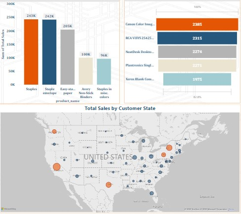

# E-Commerce-Project
E-Commerce Analysis of an organization's products and its customers in different Regions and States in the US for the year 2021 and 2022 showing important metrics using the E-commerce data

E-commerce (electronic commerce) is the buying and selling of goods and services, or the transmitting of funds
or data, over an electronic network, primarily the internet. These business transactions occur either as
business-to-business (B2B), business-to-consumer (B2C), consumer-to-consumer or consumer-to-business.
Successful ecommerce businesses need to optimize every stage of the customer journey, from first touch to
marketing to purchase. Ecommerce dashboards aggregate the most important performance metrics, so firms
can track their progress and quickly respond to any marketing changes.
Hence, as a data analyst in an e-commerce firm is to provide the best insights for businesses to improve their
sales and maximize their profit.
The sole aim of an E-commerce firm in analysing its data is to create a competitive advantage over their
competitors.

CASE PROBLEM

Our client needs to analyse and oversee its sales and marketing process effectively.
The client’s demand was to create an e commerce analysis dashboard for the year 2021 and 2022 so they can have insights on the
following:
· Year-to-Date (YTD) sales, profit, quantity sold, profit margin.
· Find the sales performance by each state
· Top 5 and bottom 5 products by sales
· Sales by region to know best and worst performing region all over the country
· Sales by shipping type to get the best shipping type percentage
· Total Sales Trend by Year and Month for 2021 and 2022
· Total Profit Trend by Year and Month for 2021 and 2022
· Top 5 Total Sales by Customer
· Total Profit by Customer Segment

DATA PROCESSING
1. REQUIREMENT GATHERING
The dataset provided was the E commerce dataset which has 18 columns and 113,271 rows.
2. DATA CLEANING
Data was checked to ascertain the data quality. Checks for duplicates were done and checks for blanks. The data was ascertained for
completeness and no
inconsistencies were found.
The data types were also checked, and the order date and ship date column weren’t in the correct data type and were changes using
the =TEXT FORMULA, =TEXT(CELL,
“DD-MM-YYYY”).
Afterwards, the text-to-column function to change to the date format “MDY”
3. DATA MODELING
Before this, a Date-Time Intelligence DAX Function was done using the New Table to create a CALENDAR Function and New Column to
create Year-To-Date Function (Year, Month, Day).
Afterwards, New Calendar Date was linked to the Order Date on the Ecommerce data
4. DATA ANALYSIS
Two (2) Visualisation Dashboards were created showing the firm’s marketing and sales financials across different regions and states
in US for the Year 2021 and 2022.
5. INSIGHTS AND RECOMMENDATIONS
From the visualised dashboard, data driven decisions and insights were drafted.

INSIGHTS AND RECOMMENDATIONS

i. The top 5 products with the highest sales are staples $242,271, staple envelopes $241,675, easy staple paper $204,567, avery-non-stick binder
$100,135, and staples in misc colors $96,287 while
ii. The bottom 5 products with the lowest sales are canon MF8580Cdw $2,385, RCA ViSYS 25423RE1 Corded phone $2,315, NeatDesk Desktop Scanner
& Digital Filing System $2,274, Plantronics Single Ear Headset $2,271, and Xerox Blank Computer paper $1,975.
Hence, in other to increase Ecommerce sales, there should be more focus on the sale on the top selling products.
iii. The top customer region with the highest total sales is the west with $15,454,324 (32.25%) of the 4 regions followed by the east $13,587,719
(28.35%). Therefore, an effective marketing strategy should focus on these regions for marketing strategy to hit the desired goals of increasing sales
and maximizing profit.
iv. Customers preferred the standard shipping type to other 3 shipping categories with same day shipping type having 5.39% and the standard class
having the bulk ( 61.38%).
v. Furthermore, Customers from California accumulated the highest sales made in both 2021 and 2022 totalling $9,672,991 followed by other top 4
states namely Texas $4,765,933, New York $5,335,097, Pennsylvania $2,844,375, and Washington $2,425,581. These 5 states totalled 52.26%, slightly
over half of the total 49 states, which further emphasizes the need to direct more marketing strategies at these top 5 states to maximise sales and profit.
vi. The Consumer customer segment had the highest total sales 51.94% as compared to the corporate 30.41% and home office customer segment
17.65%.
vii. The customer with the highest purchase was Mary Miller $190,926 followed by Mary Preis $178,200.
viii. Lastly, going by total sales and total profit trend for the year 2021 and 2022 across January to December.
There was almost an even distribution in total sales for 2021 with total sales being at the highest in January $1,967,191 and February being the lowest
$1,782,137 whereas highest total sales was made in October for the year 2022 at $3,231,406 and lowest in December $1,389,280.
April had the highest profit $245,868 in the year 2021 and a high drop in January having total sales of $150,628 while in the year 2022, highest total
profit was made in the month of October $402,565, and the lowest profit at $186,669 in the month of December

SUMMARY

This e-commerce analysis provides valuable insights into the performance and trends within the business:
PRODUCT FOCUS: The top-selling products include staples and related office supplies, indicating a need for increased promotion and
attention to these items to drive sales.
REGIONAL STRATEGY: The West and East regions stand out as the highest-performing areas, suggesting the importance of targeted
marketing efforts in these regions to boost sales and profitability.
SHIPPING PREFERENCES: Standard shipping is the preferred choice among customers, emphasizing the need for efficient and reliable
logistics to maintain customer satisfaction.
KEY SALES STATES: Five states (California, Texas, New York, Pennsylvania, and Washington) contribute significantly to sales,
necessitating focused marketing strategies in these regions.
CUSTOMER SEGMENTS: The consumer segment dominates, calling for tailored product offerings and marketing strategies to cater to
their preferences while not neglecting corporate and home office customers.
TOP CUSTOMERS: Recognizing and rewarding top customers like Mary Miller and Mary Preis can enhance customer loyalty and
retention.
SALES AND PROFIT TRENDS: Analysis of sales and profit trends across 2021 and 2022 highlights fluctuations throughout the year,
necessitating adjustments in inventory, marketing strategies, and promotions for optimal performance.
Incorporating these insights into the e-commerce strategy will help drive sales, maximize profits, and ensure a customer-centric
approach to business operations
